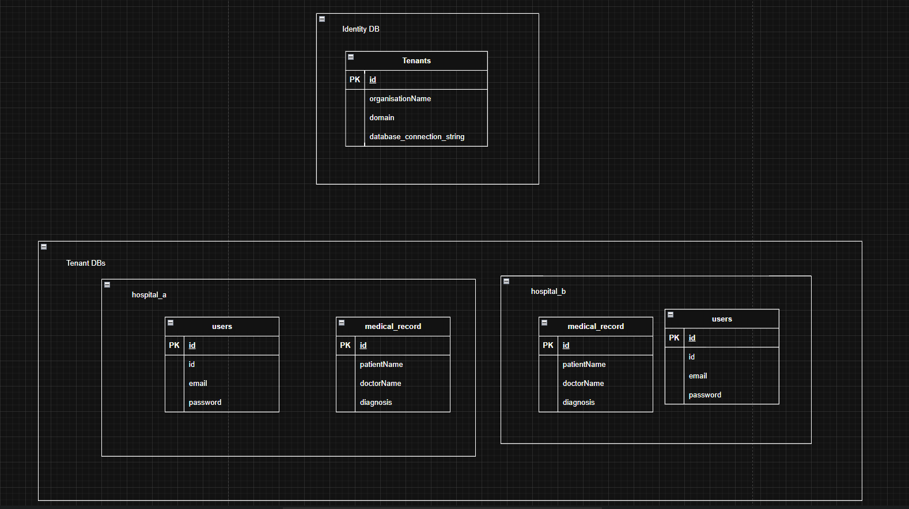

# Multitenant App (NestJS)

An application obeying the rules of multi-tenancy

## Database Diagram

## Key Concept

This app follows the multiple databases, one application pattern, using domain as the distinguishing feature.

The approach is simple:

1. The identity database's datasource used for getting tenant information is fixed and initialized on start of the application
2. The other databases datasource are initialized (once) while the app is running (lazy init)
3. Once a datasource is initialized, it is cached in a HashMap for reuse
4. We allow for an authenticated and an unauthenticated entrypoints to the db
5. The authenticated entrypoint uses the request context to get the user details and make requests to the right datasource
6. The unauthenticated entrypoint uses the email domain of the user to make requests to the right datasource

This architecture allows us to introduce multiple databases into the app as time progresses by simply adding new rows to the tenants table in the identity db